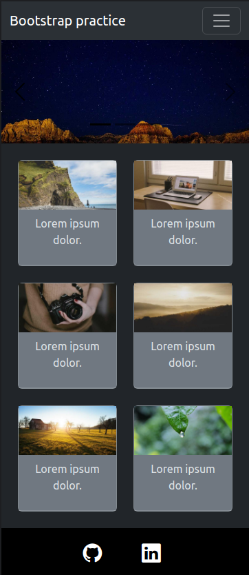
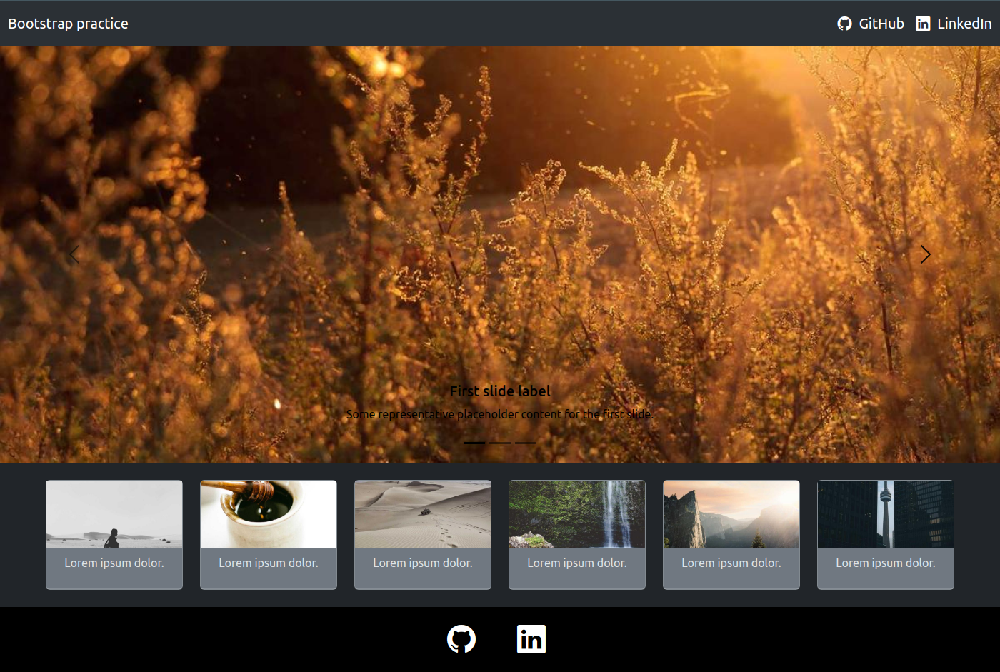
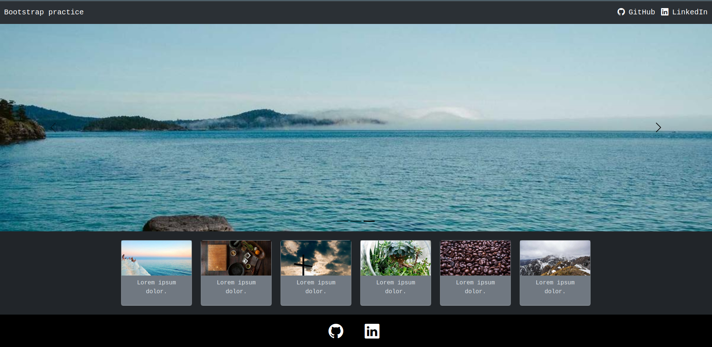

# Bootstrap practice

## 🇺🇸 About this project

This is a simple web page built to practice using the Bootstrap framework's components, such as navbar, carousel, cards and icons.
 
The random images in this project are from <a href="http://picsum.photos" target="_blank">Lorem Picsum</a>.
 
You can check the web page <a href="https://bootstrap-practice-rho.vercel.app/" target="_blank">here</a>.

> 💬 If you have any suggestions or feedbacks, I would be happy to recieve them through <a href="https://www.linkedin.com/in/bshiromoto/" target="_blank">LinkedIn</a>!

## 🇧🇷 Sobre este projeto

Esta é uma página da web simples desenvolvida para praticar o uso dos componentes do <i>framework</i> Bootstrap, como barra de navegação, carrossel, cards e ícones.
As imagens aleatórias deste projeto são do <a href="http://picsum.photos" target="_blank">Lorem Picsum</a>.
Você pode ver esta página <a href="https://bootstrap-practice-rho.vercel.app/" target="_blank">aqui</a>.

> 💬 Se tiver alguma sugestão ou feedback, eu ficaria feliz em recebê-los pelo meu <a href="https://www.linkedin.com/in/bshiromoto/" target="_blank">LinkedIn</a>!

## 🖼️ Screenshots

  
  
   
  

## 🛠️ Technologies used/Tecnologias utilizadas
### Programming languages/Linguagens de programação:

### Frameworks and libraries/Frameworks e bibliotecas:

### Tools and platforms/Ferramentas e plataformas:

